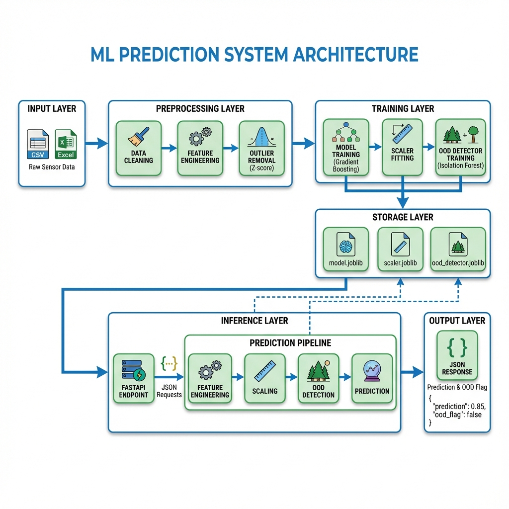
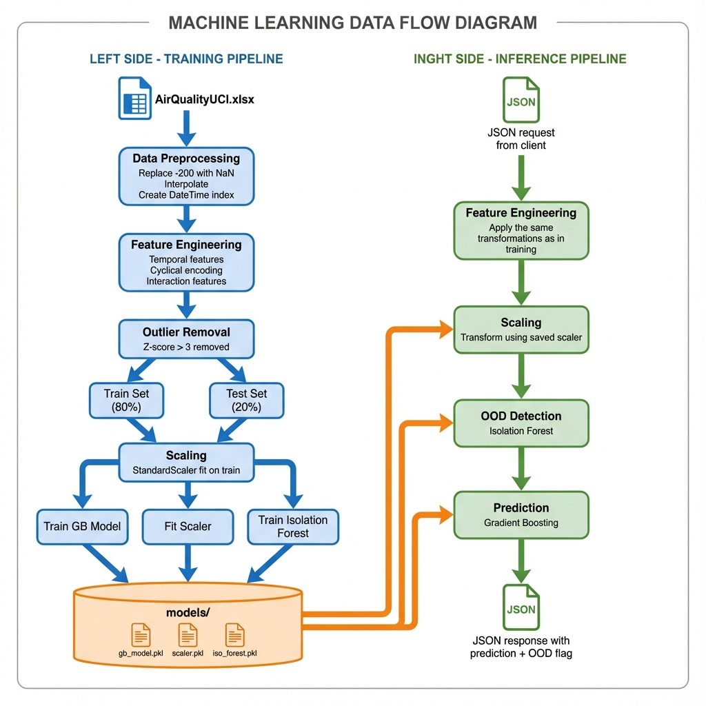

# AirGuard: CO Forecasting & Anomaly Detection System

This project develops and validates a machine learning system to predict Carbon Monoxide (CO) levels from the AirQualityUCI dataset. It includes a complete end-to-end workflow from data cleaning and model training to a deployable API for live predictions.

## Key Features
- **End-to-End Workflow:** Covers data cleaning, feature engineering, and a full training pipeline.
- **Advanced Modeling:** Compares Linear Regression, Random Forest, and Gradient Boosting, with hyperparameter tuning. The final model is a tuned `GradientBoostingRegressor`.
- **Statistical Validation:** Uses paired t-tests, ANOVA, and confidence intervals to rigorously prove model performance.
- **OOD Detection:** Implements an `IsolationForest` to identify and flag anomalous sensor readings, ensuring model robustness.
- **API for Deployment:** A production-ready API built with FastAPI to serve live predictions.
- **Containerization:** A `Dockerfile` is included to package the application for easy and consistent deployment.

## Project Structure
```
.
├── AirQualityUCI.csv       # Dataset (CSV format)
├── AirQualityUCI.xlsx      # Dataset (Excel format)
├── air+quality.zip         # Original zipped dataset
├── api/
│   └── app.py              # FastAPI application script
├── models/                 # Trained model, scaler, and OOD detector
├── notebooks/
│   └── co_prediction.ipynb # Main exploratory and analysis notebook
├── src/
│   ├── data_preprocessing.py   # Script for cleaning data
│   ├── feature_engineering.py  # Script for creating features
│   ├── predict.py              # Script for making predictions
│   └── train.py                # Main training pipeline script
├── .gitignore
├── Dockerfile
├── README.md
└── requirements.txt
```

## How to Use This Project

### 1. Setup
1. Clone the repository:
   ```bash
   git clone https://github.com/YaswanthDonthuboyina/Co-Prediction.git
   cd your-repo-name
   ```
2. **Download the Dataset**:
   - Download the **Air Quality Data Set** from the [UCI Machine Learning Repository](https://archive.ics.uci.edu/ml/datasets/Air+Quality).
   - After extracting, ensure `AirQualityUCI.csv`, `AirQualityUCI.xlsx`, and `air+quality.zip` are placed in the root of the project directory.

3. Create and activate a virtual environment (recommended):
   ```bash
   python -m venv venv

   # Activation commands for different environments:
   # On Linux / macOS
   source venv/bin/activate

   # On Windows (Command Prompt)
   venv\Scripts\activate

   # On Windows (PowerShell)
   .\venv\Scripts\Activate.ps1

   # On Windows (Git Bash / MinGW)
   . venv/Scripts/activate
   ```
4. Install the required dependencies:
   ```bash
   pip install -r requirements.txt
   ```

### 2. Train the Model
Run the training pipeline. This will process the data, train the model, scaler, and OOD detector, and save them into the `models/` directory.
```bash
python src/train.py
```

### 3. Run the API
You can run the prediction API in two ways:

#### Option A: Run Locally with Uvicorn
This is great for development and testing.
```bash
uvicorn api.app:app --reload
```
The API will be available at `http://127.0.0.1:8000`.

#### Option B: Run with Docker (Recommended for Production)
This uses the containerized application.
1. Build the Docker image:
   ```bash
   docker build -t co-predictor-api .
   ```
2. Run the Docker container:
   ```bash
   docker run -p 8000:8000 co-predictor-api
   ```
The API will be available at `http://127.0.0.1:8000`.

### 4. Deployed API

Your application is deployed on Render and is accessible at:
- **Base URL:** [https://co-prediction.onrender.com/](https://co-prediction.onrender.com/)
- **API Documentation (Swagger UI):** [https://co-prediction.onrender.com/docs](https://co-prediction.onrender.com/docs)

### 5. Use the API
Once the API is running, you can interact with it.

#### Interactive Docs (Swagger UI)
Navigate to `http://127.0.0.1:8000/docs` in your browser for a full, interactive API documentation where you can test the endpoint directly.

#### Example with `curl`
Send a `POST` request to the `/predict` endpoint with your data.
```bash
curl -X POST "http://127.0.0.1:8000/predict" \
-H "Content-Type: application/json" \
-d 
{
    "DateTime": "2025-10-20T18:00:00",
    "PT08_S1_CO": 1360.0,
    "NMHC_GT": 150.0,
    "C6H6_GT": 11.9,
    "PT08_S2_NMHC": 1046.0,
    "NOx_GT": 166.0,
    "PT08_S3_NOx": 1056.0,
    "NO2_GT": 113.0,
    "PT08_S4_NO2": 1692.0,
    "PT08_S5_O3": 1268.0,
    "T": 13.6,
    "RH": 48.9,
    "AH": 0.7578
}
```

**Example Response:**
```json
{
  "prediction_co_gt": 2.7635,
  "is_out_of_distribution": false,
  "model_version": "1.0.0"
}
```

## Summary of Results
The final model, a tuned `GradientBoostingRegressor`, achieved a mean R² of **0.916** across 5-fold cross-validation. The Out-of-Distribution (OOD) detection module was able to correctly identify synthetic anomalous data with **96% accuracy**.

## System Architecture

### High-Level Architecture


### Data Flow Pipeline


### Key Components
- **Data Pipeline:** Handles preprocessing, feature engineering (temporal, cyclical, interactions), and outlier removal.
- **Dual OOD Detection:** 
  1. **Training:** Z-score based outlier removal.
  2. **Inference:** Isolation Forest anomaly detection.
- **Model:** Gradient Boosting Regressor (R² = 0.916).
- **Deployment:** FastAPI service containerized with Docker.

### Quick Links
- **Production API:** [https://co-prediction.onrender.com](https://co-prediction.onrender.com)
- **Interactive API Docs:** [https://co-prediction.onrender.com/docs](https://co-prediction.onrender.com/docs)
